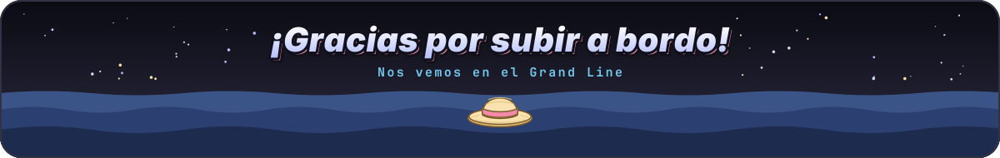

<picture>
  <source media="(max-width: 640px)" srcset="assets/cabecera-movil.svg">
  
</picture>

<picture>
  <source media="(max-width: 640px)" srcset="assets/tripulacion-movil.svg">
  
</picture>

<a href="https://github.com/NicoElMaster/vscode-setup">
  <picture>
    <source media="(max-width: 640px)" srcset="assets/bandera-publica-movil.svg">
    
  </picture>
</a>

<!-- 

  

  -->

<picture>
  <source media="(max-width: 640px)" srcset="assets/pie-movil.svg">
  
</picture>
